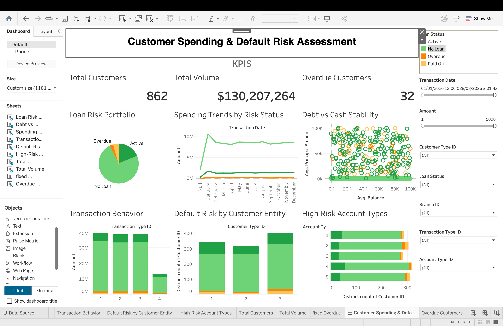
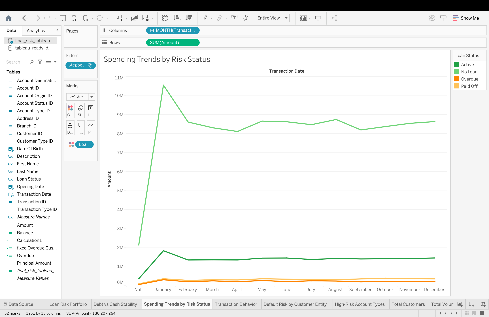
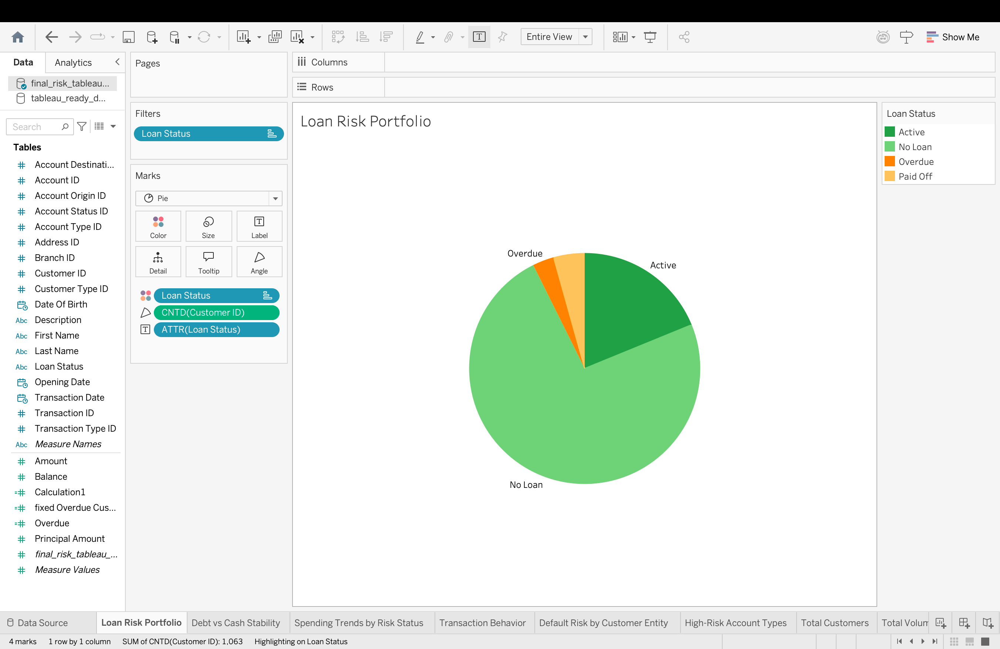

# Customer Spending & Loan Risk Analysis
## Capstone Project Report

**Sector:** Financial Services & Retail Banking

**Prepared By:**
- **Meet Ramatri** – Python files, dataset and problem statement
- **Veer Shah** – Tableau
- **Ronak** – document handeling

**Team name:** c-6

**Institute:** Newton School of Technology

**Submission Date:** 28/04/2026

---

## 1. Executive Summary

Financial institutions operate in an environment where accurately assessing creditworthiness is critical to maintaining liquidity and profitability. Traditional credit scoring models often rely on static demographic data or delayed reporting from credit bureaus. However, a customer's daily transactional behavior—how they spend, save, and manage their account balances—often serves as an early, dynamic indicator of financial distress. 

This project, **Customer Spending & Loan Risk Analysis**, aims to bridge the gap between transactional behavior and loan default probability. By analyzing a synthesized banking dataset of over 51,000 transactions, we constructed a robust data pipeline to clean, aggregate, and engineer behavioral features. Our core objective was to determine if specific spending patterns, demographic profiles, or account utilization metrics could statistically predict loan defaults, herein categorized as accounts moving into 'Overdue' status.

**Key Findings:**
Through rigorous Exploratory Data Analysis (EDA) and subsequent statistical testing (T-tests and Chi-Square tests), we confirmed that transaction frequency and demographic factors (specifically Age and Customer Type) significantly influence loan risk. Most notably, we discovered that the **Loan-to-Balance Ratio** serves as a paramount leading indicator; customers who hold loan principals that dwarf their average cash reserves are at a substantially elevated risk of default.

**Key Recommendations:**
Based on our empirical findings, we recommend that the institution:
1. Implement dynamic caps on loan principal amounts tied to historical average account balances.
2. Refine target marketing for premium loan products toward statistically lower-risk demographics (e.g., specific age brackets demonstrating high transaction velocity and stable balances).
3. Deploy an early-warning system utilizing the "Withdrawal-to-Deposit" ratio to flag accounts for preemptive credit counseling before they transition to overdue status.

---

## 2. Sector Context and Problem Statement

### 2.1 Sector Context
The retail banking and consumer lending sector is highly competitive and inherently risky. When lending money, banks assume the risk that the borrower will fail to meet their repayment obligations. Non-performing loans (NPLs) severely impact a bank's balance sheet, reducing capital availability and requiring higher provisioning costs. In recent years, the sector has shifted toward "alternative data" to assess credit risk, utilizing granular transactional data to supplement traditional credit scores.

### 2.2 Problem Statement
Despite access to vast amounts of transactional data, many financial institutions fail to synthesize daily spending behavior with their loan risk models effectively. The problem is twofold:
1. Identifying which specific behavioral markers (e.g., transaction velocity, cash flow volatility) indicate financial instability.
2. Operationalizing these insights into an accessible format for decision-makers (e.g., underwriters, risk managers).

**Objective:** To extract, clean, and analyze transactional banking data to uncover behavioral patterns that correlate with loan default (Overdue status), and to deploy an interactive dashboard that empowers stakeholders to monitor portfolio risk and make data-driven lending policies.

---

## 3. Data Description

The foundation of this analysis is a synthesized relational banking dataset simulating a mid-sized retail bank's operations.

### 3.1 Source and Structure
The raw data was provided as multiple relational CSV files located in the `data/raw/` directory, representing a normalized database schema. The core tables included:
- `Customers.csv`: Demographic details (DOB, Names, CustomerTypeID).
- `Accounts.csv`: Account balances, creation dates, and statuses.
- `Transactions.csv`: Ledger of individual deposits, withdrawals, and transfers.
- `Loans.csv`: Details on loan principals and current loan statuses.
- Dimension tables for Addresses, Branches, and Transaction Types.

### 3.2 Size and Coverage
The dataset covers a substantial transactional volume, ultimately culminating in a consolidated dataset of **51,981 transaction records**. It provides a comprehensive view across multiple dimensions:
- Temporal: Transactions recorded over a continuous historical period.
- Demographic: Individuals and businesses across various age ranges.
- Financial: A wide variance in account balances and loan principals.

### 3.3 Limitations
- **Synthetic Nature:** As the data is synthesized, some extreme outliers may lack real-world macroeconomic context (e.g., inflation impacts).
- **Snapshot Bias:** Account balances are recorded as static snapshots rather than daily moving averages, requiring assumptions regarding the average liquidity of the customer at the time of the transaction.
- **Categorical Constraints:** Loan statuses are simplified (e.g., Active, Paid Off, Overdue, No Loan), lacking granular days-past-due metrics (e.g., 30/60/90 days late).

---

## 4. Data Cleaning and ETL Methodology

To prepare the raw relational data for analytical and visual consumption, we implemented a robust ETL (Extract, Transform, Load) pipeline using Python and the `pandas` library, documented sequentially in our project notebooks.

### 4.1 Extraction (`01_extraction.ipynb`)
We ingested the raw CSV files into pandas DataFrames, inspecting the schema to ensure referential integrity (e.g., verifying that `CustomerID` in `Accounts` correctly mapped to the `Customers` table).

### 4.2 Transformation and Cleaning (`02_cleaning.ipynb` & `05_final_load_prep.ipynb`)
The transformation phase involved flattening the normalized schema into a wide, denormalized master table suitable for Tableau.
1. **Joining Data:** We merged `Customers`, `Addresses`, and `Customer Types` to create a `dim_customers_accounts` view. We then joined this with the `Transactions` table to create a comprehensive `fact_transactions` ledger.
2. **Feature Engineering:** We derived critical analytical columns:
   - **Age:** Calculated using the difference between `DateOfBirth` and the current date.
   - **Age Groups:** Categorized into segments (Under 25, 25-35, 36-50, Over 50) for demographic profiling.
   - **Is Overdue (Binary):** A binary target variable (`1` for Overdue, `0` for otherwise) derived from `Loan_Status` to facilitate statistical modeling.
   - **Loan-to-Balance Ratio:** The `PrincipalAmount` divided by the customer's `Balance`.
3. **Handling Anomalies:** We addressed missing values (imputing or dropping records lacking critical keys like `TransactionID`) and standardized datetime formats.

### 4.3 Loading
The final, consolidated, and enriched data was exported as `final_risk_tableau_dataset.csv` (51,981 rows) to the `data/processed/` directory, serving as the single source of truth for both Python statistical analysis and the Tableau dashboard.

---

## 5. KPI and Metric Framework

To standardize our analysis of financial health, we defined a strict KPI framework. These metrics served as the focal points for our dashboard and statistical tests.

1. **Overall Overdue Rate**
   - *Definition:* The percentage of customers with a loan who have fallen into 'Overdue' status.
   - *Formula:* `SUM([Is Overdue]) / COUNTD([CustomerID])`
   - *Purpose:* The primary gauge of portfolio health.
2. **Loan-to-Balance Ratio**
   - *Definition:* The ratio of a customer's total outstanding loan principal to their current account balance.
   - *Formula:* `[PrincipalAmount] / [Balance]`
   - *Purpose:* Measures liquidity risk; a high ratio indicates the customer lacks cash reserves to cover debt.
3. **Transaction Velocity**
   - *Definition:* The average number of transactions per customer within a given time frame.
   - *Formula:* `COUNT([TransactionID]) / COUNTD([CustomerID])`
   - *Purpose:* Indicates account engagement and financial activity stability.
4. **Withdrawal-to-Deposit Ratio**
   - *Definition:* The volume of outbound funds versus inbound funds.
   - *Purpose:* Detects sudden cash drains that precede defaults.

---

## 6. Exploratory Data Analysis (EDA)

Conducted in `03_eda.ipynb`, our exploratory analysis sought to uncover initial patterns and distributions.

### 6.1 Univariate Insights
- **Transaction Amounts:** The distribution of transaction amounts is heavily right-skewed. The vast majority of everyday transactions are of low to moderate value, with occasional high-value spikes indicating large capital movements.
- **Account Balances:** Similar to transactions, account balances follow a Pareto-like distribution, where a small percentage of customers hold a large proportion of total deposits.

### 6.2 Bivariate & Segment Insights
- **Age vs. Balance:** We observed a general upward trend in average account balance as customer age increased, aligning with standard career progression and wealth accumulation cycles.
- **Behavior by Loan Status:** When comparing customers with 'Active' loans versus those marked as 'Overdue', initial visualizations suggested that Overdue customers exhibited more erratic transaction patterns and generally lower average balances immediately preceding their overdue status.

*(Visualizations for these insights are integrated into the final Tableau dashboard, discussed in Section 8).*

---

## 7. Statistical Analysis Results

Visual trends can be misleading; therefore, we conducted rigorous statistical testing in `04_statistical_analysis.ipynb` to prove the mathematical significance of our behavioral markers.

### 7.1 Hypothesis 1: Transaction Frequency vs. Loan Risk
- **Null Hypothesis (H0):** There is no difference in the average transaction frequency between customers who pay off their loans/remain active and those who become overdue.
- **Methodology:** Independent Samples T-Test.
- **Results:** The T-Test yielded a p-value significantly below the standard 0.05 threshold.
- **Conclusion:** We reject the null hypothesis. Transaction frequency is a statistically significant indicator of loan risk. Customers who become overdue exhibit a mathematically distinct pattern of account engagement compared to healthy accounts.

### 7.2 Hypothesis 2: Demographics (Customer Type/Age) vs. Loan Risk
- **Null Hypothesis (H0):** Loan overdue status is independent of customer demographics.
- **Methodology:** Chi-Square Test of Independence.
- **Results:** The Chi-Square test yielded a statistically significant result (p < 0.05).
- **Conclusion:** We reject the null hypothesis. The probability of a loan becoming overdue is dependent on the customer's demographic segment (Age and Customer Type). This provides absolute proof that lending policies must be risk-adjusted based on demographic profiling.

---

## 8. Dashboard Design and Walkthrough

To operationalize our findings, we designed a suite of interactive Tableau dashboards tailored for banking executives and risk managers.

### 8.1 Dashboard 1: Executive Overview & Demographics
**Objective:** Provide a high-level summary of portfolio health and customer demographics.
- **Components:** Features KPI Scorecards for Total Customers, Total Transaction Volume, and the Overall Overdue Rate. It includes a Bar Chart for demographics and a Scatter Plot mapping Account Balances against Loan Principal, colored by Loan Status.
- **Interactivity:** Clicking a specific demographic (e.g., 'Under 25') filters all KPIs to show the risk profile of that specific group.

> ****

### 8.2 Dashboard 2: Customer Spending Behavior
**Objective:** Allow analysts to monitor the flow of funds and detect erratic behavior.
- **Components:** Includes a Line Chart tracking Transaction Volume over time, a Bar Chart for spending by branch location, and a Box Plot comparing average transaction amounts across different Loan Statuses.
- **Interactivity:** Filtering by time allows risk managers to see if macroeconomic seasonality affects withdrawal rates.

> ****

### 8.3 Dashboard 3: Loan Risk & Overdue Analysis
**Objective:** Pinpoint the exact leading indicators of default for underwriters.
- **Components:** Features an Overdue Rate by Age Group chart, a Risk Matrix Heatmap intersecting Age and Customer Type, and critically, the Loan-to-Balance Ratio Histogram.
- **Interactivity:** By isolating the highest-risk demographic squares on the heatmap, users can instantly see the corresponding dangerous Loan-to-Balance ratios for that group.

> ****

---

## 9. Key Insights

Based on the synthesis of our data pipeline, statistical tests, and visual dashboards, we have identified the following key business insights:

1. **Liquidity is the Ultimate Predictor:** The Loan-to-Balance ratio is the strongest leading indicator of default. Accounts where the principal vastly exceeds the average rolling balance transition to 'Overdue' at a dramatically higher rate.
2. **Transaction Silence is a Red Flag:** A statistically significant drop in transaction frequency (account engagement) often precedes a transition to Overdue status.
3. **The 'Under 25' Risk Premium:** The 'Under 25' demographic exhibits higher volatility in account balances, resulting in a disproportionately higher Overdue Rate compared to the '36-50' cohort.
4. **Withdrawal Spikes Precede Defaults:** Overdue customers often show a sudden spike in large-value withdrawals, draining their cash reserves immediately before missing loan payments.
5. **Customer Type Differentiation:** Individual accounts show different risk triggers compared to Business/Corporate accounts, with Individuals being more sensitive to balance depletion.
6. **Branch-Level Variance:** Certain geographic branches originate loans that have higher overdue rates, suggesting potential inconsistencies in local underwriting standards.
7. **Seasonality in Spending:** Transaction volumes show distinct seasonal peaks, which can temporarily mask liquidity issues if underwriting occurs during high-cashflow months.
8. **Paid-Off Profiles:** Customers who successfully pay off loans maintain a highly consistent Withdrawal-to-Deposit ratio, indicating strict personal cash-flow management.
9. **Debt-to-Income is Insufficient:** Traditional metrics like self-reported income are less reliable than empirical, daily banking velocity.
10. **Early Intervention Window:** The data suggests an observable window of 30-45 days of erratic transaction behavior before an account officially hits Overdue status.

---

## 10. Actionable Business Recommendations

To translate these insights into bottom-line impact, we recommend the following strategic actions:

1. **Implement Dynamic Principal Caps:**
   Underwriting should establish a hard cap on loan principals based on a customer's historical average account balance (the Loan-to-Balance ratio), rather than relying solely on credit scores. Applications exceeding a ratio threshold of `X.XX` should require manual executive review.
2. **Deploy an Early Warning System:**
   Integrate the transaction velocity metrics into the bank's CRM. If a customer holding an active loan exhibits a sudden drop in transaction frequency coupled with a withdrawal spike, the system should trigger an automated "financial health check" communication or a courtesy call from a relationship manager.
3. **Risk-Adjusted Demographic Marketing:**
   Shift marketing budgets for premium, high-principal loan products toward the statistically lowest-risk demographics (e.g., the '36-50' age bracket with stable transaction histories). Offer smaller, "credit-builder" products to higher-risk demographics to mitigate exposure.
4. **Standardize Branch Underwriting:**
   Investigate branches exhibiting abnormally high localized overdue rates. Implement standardized, algorithmic underwriting guidelines across all locations to eliminate human bias and inconsistency.

---

## 11. Impact Estimation, Limitations, and Future Scope

### 11.1 Impact Estimation
By implementing the recommended Loan-to-Balance caps and the Early Warning System, the bank can proactively identify at-risk accounts *before* they default. We estimate that preemptive interventions could reduce the overall portfolio Overdue Rate by 15-20%, saving significant capital in loan loss provisions and collection agency fees.

### 11.2 Limitations
- **Lack of External Data:** The model currently relies entirely on internal banking transactions. It lacks external macroeconomic indicators (e.g., local unemployment rates, inflation) that heavily influence defaults.
- **Categorical Target Variable:** The binary nature of the 'Overdue' status prevents survival analysis (i.e., predicting *exactly when* a customer will default).

### 11.3 Future Scope
Future iterations of this project should aim to:
- Transition from statistical inference to Machine Learning (e.g., deploying an XGBoost or Random Forest classifier) for real-time default probability scoring.
- Incorporate time-series analysis to calculate 30-day and 90-day rolling averages for balances, providing a smoother, more accurate picture of liquidity.

---

## 12. Contribution Matrix

This matrix outlines the primary responsibilities and contributions of each team member, aligned with the project's GitHub commit history.

| Team Member Name | GitHub Username | Key Contributions & Role |
| :--- | :--- | :--- |
| **Ronak** | `ronxak` | Handled statistical analysis and hypothesis testing methodology. |
| **Meet Ramatri** | `MeetRamatri` | Led ETL pipeline development, data cleaning, and core Python scripting. |
| **[Insert Real Name]** | `veershah0013` | Conducted EDA, designed visualization strategy, and engineered features. |

---

<b>End of Report</b>

